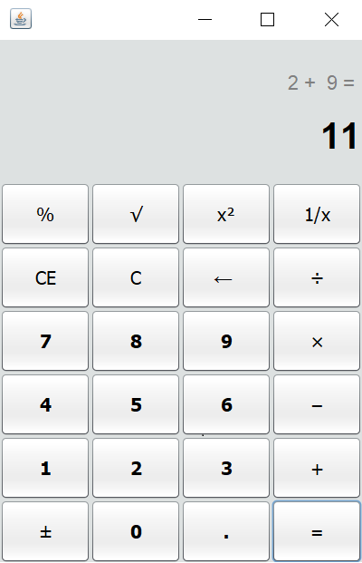

# CALCULATOR
This project has been created using NetBeans in Java. It's a simple calculator with GUI similar to the windows calculator. All the functionalities of a basic calculator are offered by the calculator GUI.

## CALCULATOR GUI
The calculator GUI is designed using Swing which is a GUI widget toolkit for Java. It provides a JFrame class, which has the components like labels, buttons, textfields etc that can be added to create a GUI.
This calculator GUI is designed similar to the GUI of windows calculator. The buttons to all the functionalities/operations are designed accordingly.

The GUI looks as follows:

## FUNCTIONALITIES
The calculator performs all of the functionalities provided by the GUI. The backend contains the action performed on each button. You can run the project by running ``src/CalculatorGUI.java`` 

